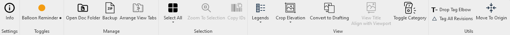

# pyKostik
Extension with some useful tools for [pyRevit](https://github.com/eirannejad/pyRevit)

## Installation and Management
### Requirements
- Installed [latest pyRevit release](https://github.com/eirannejad/pyRevit/releases/latest).
- Installed `pyRevit CLI` from the [latest pyRevit release](https://github.com/eirannejad/pyRevit/releases/latest) (needs admin rights).
### Install
- In `Windows Command Prompt` run command:
    ```cmd
    pyrevit extend ui pyKostik "https://github.com/nodatasheet/pyKostik" --branch=main
    ```
- In PyRevit Tab on the bottom left press `Reload` button.
### Update
- Option 1: using pyRevit.
    - In pyRevit Tab on the bottom left press `Update` button.
    - You can also enable automatic updates in pyRevit -> Settings -> Core Settings -> Check updates at startup
- Option 2: using command line
    - In `Windows Command Prompt` run command:
        ```cmd
        pyrevit extensions update pyKostik
        ```
    - In PyRevit Tab on the bottom left press `Reload` button.
### Uninstall
- Option 1: using pyRevit.
    - in pyRevit -> Extensions -> select `pyKostik` and press `Remove Extension`.
- Option 2: using command line
    - In `Windows Command Prompt` run command:
        ```cmd
        pyrevit extensions delete pyKostik
        ```
    - In PyRevit Tab on the bottom left press `Reload` button.
## Credits
- All developers and contributors of [pyRevit](https://github.com/eirannejad/pyRevit)
- [Icons8](https://icons8.com/) for free icons
